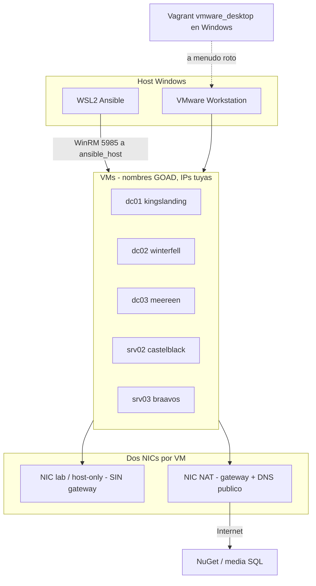
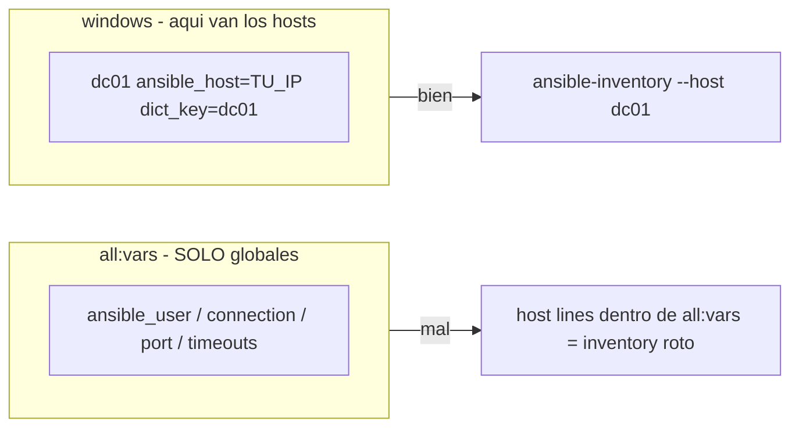

# GOAD en WSL + VMware

Bitacora de un provision real de [GOAD](https://github.com/Orange-Cyberdefense/GOAD) **sin Vagrant**: VMs creadas a mano en VMware Workstation y Ansible corriendo desde **WSL2**.

No sustituye el README oficial. Documenta el camino que toca cuando el provider Vagrant/VMware en Windows no levanta y WSL se pone pesado.

## Por que existe este repo

El camino oficial en VMware es:

1. Plugin `vagrant-vmware-desktop` + Vagrant VMware Utility en el **host Windows**
2. `vagrant up` desde `ad/GOAD/providers/vmware` (`provider = vmware_desktop`)
3. Ansible desde Linux (`goad.sh` o un controller VM)

En la practica, en host Windows ese plugin **se rompe** o no aparece:

- `The provider 'vmware_desktop' could not be found` ([GOAD#346](https://github.com/Orange-Cyberdefense/GOAD/issues/346))
- conflictos de gems al instalar plugins ([GOAD#392](https://github.com/Orange-Cyberdefense/GOAD/issues/392))
- utility/certificados, licencia, `force_vmware_license`
- el plugin habla con VMware en el host; WSL **no** sustituye eso

Cuando Vagrant no clona las cajas, la alternativa es: cinco VMs 2019 a mano + WinRM + inventory propio + Ansible desde WSL. Este repo es esa alternativa y los golpes que da.

WSL, por su lado, no es inocente:

- si clonas GOAD bajo `/mnt/c/...`, Ansible ignora `ansible.cfg` (*world writable directory*)
- la IP de WSL2 no es la del host-only de VMware; el ping a las VMs sale por otra ruta
- timeouts WinRM por defecto (30 s) se quedan cortos en un dcpromo
- ansible-core >= 2.19 revienta los `when: two_adapters` de GOAD (strings `yes`/`no`)

Si el plugin de Vagrant te funciona, usa el inventory oficial y `goad.sh`. Este texto es para cuando no.

## Las IPs las pones tu

`192.168.56.10` etc. son **ejemplo** (VMnet host-only tipica). Tu lab puede ser `192.168.100.0/24`, `10.10.10.0/24` o lo que pinte VMware Virtual Network Editor.

Lo que tiene que cuadrar:

| Dato | Donde |
|---|---|
| IP de cada VM (NIC del lab) | `ansible_host=` en `[windows]` |
| Misma L3 entre WSL/host y esa NIC | ping + TCP 5985 |
| `dict_key` | `dc01`..`srv03` como en `config.json` |
| Password | `local_admin_password` de **tu** `config.json`, no un invento |

No copies las IPs de esta guia si tu VMnet es otra. Cambia solo `ansible_host`.



## Topologia de ejemplo

Sustituye la columna IP por la tuya. Las passwords son las del `config.json` **canonico** de GOAD; si las cambiaste, usa las tuyas.

| Inventory | Hostname | IP de ejemplo | Dominio | local_admin_password |
|---|---|---|---|---|
| dc01 | kingslanding | 192.168.56.10 | sevenkingdoms.local | `8dCT-DJjgScp` |
| dc02 | winterfell | 192.168.56.11 | north.sevenkingdoms.local | `NgtI75cKV+Pu` |
| dc03 | meereen | 192.168.56.12 | essos.local | `Ufe-bVXSx9rk` |
| srv02 | castelblack | 192.168.56.22 | north.sevenkingdoms.local | `NgtI75cKV+Pu` |
| srv03 | braavos | 192.168.56.23 | essos.local | `978i2pF43UJ-` |

Cada VM: **dos NICs**.

- NIC lab: IP fija del inventario, **sin** gateway
- NIC NAT: gateway del VMnet NAT + DNS `1.1.1.1,8.8.8.8`

Sin NAT no hay NuGet ni media de SQL.

## Fotos / capturas

Si subes pantallazos al repo o a un writeup:

- Tapa o recorta IPs reales, hostnames de tu PC, usuario Windows, rutas `/home/...` y hashes
- No subas `inventory.ini` con passwords si el repo es publico (este README usa las del config.json publico de GOAD; las tuyas si las cambiaste no van aqui)
- Preferible diagrama (Mermaid arriba) antes que un `ipconfig` entero
- `PLAY RECAP` sin extra-vars en la linea de comando

Los diagramas de este README no llevan IPs ni secretos de un lab concreto.



## Requisitos

- WSL2 + venv GOAD. Mejor clonar en el FS de Linux (`~/GOAD`), no en `/mnt/c`
- Collections de `requirements.yml`
- 5x Server 2019 en VMware, WinRM HTTP 5985
- `ansible.cfg`:

```ini
[defaults]
allow_broken_conditionals = true
```

GOAD guarda `two_adapters="yes"` como string. ansible-core >= 2.19 exige bool en `when:`.

```bash
export ANSIBLE_ALLOW_BROKEN_CONDITIONALS=true
```

si Ansible ignora el cfg por directorio world-writable.

## Inventory

`[all:vars]` = globales. Hosts = grupo `[windows]`. Plantilla: [docs/INVENTORY.md](docs/INVENTORY.md).

- `dict_key` obligatorio
- grupo oficial `[server]`, no `[servers]`
- `read_timeout_sec` > `operation_timeout_sec` (400/500)
- ADCS oficial:

```ini
[adcs]
dc01
srv03

[adcs_customtemplates]
dc03
```

Sin `[adcs]`, no hay CertSvc y ESC6 muere con `certutil ... FILE_NOT_FOUND`.

`[laps_dc]` oficial es **dc03**. Meter dc01+dc02 = referral/FSMO.

## Orden de playbooks

```bash
cd ~/GOAD/ansible
ansible-playbook -i inventory.ini build.yml
ansible-playbook -i inventory.ini ad-servers.yml
ansible-playbook -i inventory.ini ad-parent_domain.yml
ansible-playbook -i inventory.ini ad-child_domain.yml
ansible-playbook -i inventory.ini ad-members.yml
ansible-playbook -i inventory.ini ad-trusts.yml
ansible-playbook -i inventory.ini ad-data.yml
ansible-playbook -i inventory.ini ad-gmsa.yml
# laps.yml puede fallar (bug mayContain). No bloquea el lab.
ansible-playbook -i inventory.ini localusers.yml
ansible-playbook -i inventory.ini ad-relations.yml
ansible-playbook -i inventory.ini adcs.yml
ansible-playbook -i inventory.ini ad-acl.yml
ansible-playbook -i inventory.ini servers.yml
ansible-playbook -i inventory.ini security.yml
ansible-playbook -i inventory.ini vulnerabilities.yml
ansible-playbook -i inventory.ini reboot.yml
```

`main.yml` es reentrante. Arregla la causa y relanza ese playbook.

## Trampas

Detalle tabulado: [docs/ERRORES.md](docs/ERRORES.md).

1. **NuGet** — la VM no sale a Internet. NAT + DNS en la NIC con gateway.
2. **401 en hostname** — `admin_password` ya rotó Administrator. Inventory con `local_admin_password` por host.
3. **Timeout / 401 en dc02** — child DC + NTLM HTTP a una IP. `AllowUnencrypted=true`, `Basic=true`, `ansible_winrm_transport=basic` en ese host. Timeouts 400/500.
4. **LAPS PSObject / mayContain** — [GOAD#449](https://github.com/Orange-Cyberdefense/GOAD/issues/449). Seguir el lab.
5. **ESC13** — falta `C:\setup` en ese host.
6. **SQL SSEI 2026** — Microsoft retiro el web installer. Media offline `SQLEXPR_x64_ENU.exe` (~250 MB). El `sql_conf.ini` del rol puede traer Jinja (`//{%`); instala con flags. SSMS `aka.ms` baja un stub de ~5 MB: vacia `[mssql_ssms]`.
7. **linux_domain skipped** — no hay VMs Linux. Normal.

## Comprobaciones

```bash
ansible-inventory -i inventory.ini --host dc01
ansible dc01,dc02,dc03,srv02,srv03 -i inventory.ini -m ansible.windows.win_ping
```

En el DC (imagen en-US): `systeminfo | findstr /I "Domain Workgroup"` — la linea es `Domain:`, no `Dominio`.

```powershell
Test-WSMan localhost
winrm get winrm/config/service
```

`curl` a `:5985` con `411 Length Required` = HTTPAPI vivo; deja el firewall.

## Se puede dejar a medias

| Pieza | Impacto |
|---|---|
| LAPS schema | Solo escenario LAPS |
| SSMS | GUI |
| linux_domain | No aplica |
| defender/laps no canonico | Cambia el escenario, no tumba AD |

## Creditos

- Lab: [Orange-Cyberdefense/GOAD](https://github.com/Orange-Cyberdefense/GOAD)
- Notas de un install WSL+VMware (sep 2026). URLs de Microsoft caducan. Revisa **tu** `config.json` antes de copiar passwords.
