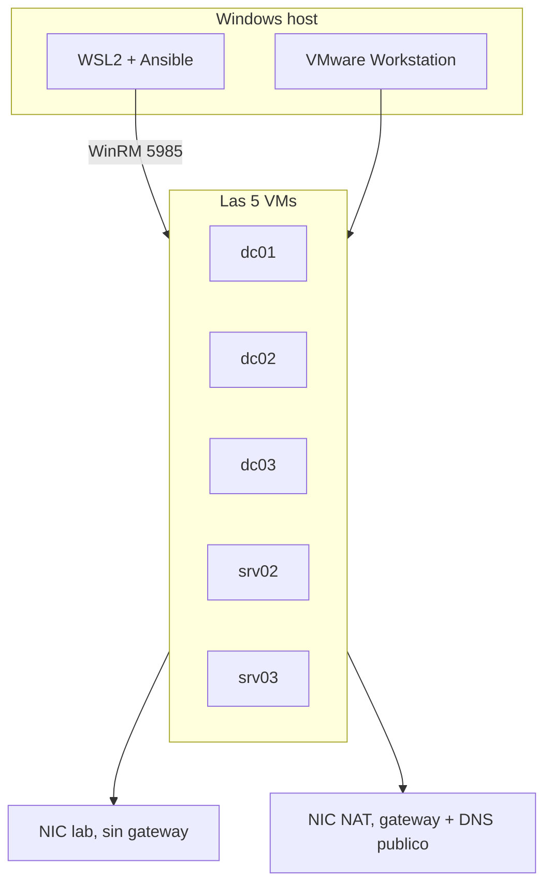

# GOAD desde WSL contra VMware

Monte GOAD (el de Orange-Cyberdefense) sin pasar por Vagrant. Las cinco Windows estan en VMware Workstation y Ansible corre desde WSL2. Este repo es lo que me hubiera gustado leer el dia 1, no un reemplazo del README oficial.

## Por que no use el provider de VMware

GOAD espera Vagrant + plugin `vagrant-vmware-desktop` + VMware Utility en el host Windows, `vagrant up` en `ad/GOAD/providers/vmware`, y Ansible en Linux.

A mi se me cayo por esto: [hashicorp/vagrant-vmware-desktop#177](https://github.com/hashicorp/vagrant-vmware-desktop/issues/177) — el Vagrant VMware Utility **no reconoce la version nueva de Workstation**. Sin utility no hay provider, `vagrant up` no levanta las cajas.

WSL no arregla ese plugin (corre en el host, contra VMware del host). Si te pasa lo mismo, te queda armar las VMs a mano, abrir WinRM y tirar Ansible desde WSL.

WSL por su cuenta tambien me dio guerra:

- clone en `/mnt/c/...` y Ansible ignora el `ansible.cfg` (world writable)
- la IP de WSL2 no es la del host-only
- timeout WinRM de 30s a mitad de un dcpromo
- ansible-core 2.19+ ya no acepta `when: two_adapters` si vale `"yes"`

Si el utility te detecta Workstation y `vagrant up` sale, no sigas esta guia. Usa el inventory oficial y `goad.sh`.

## Las IPs no estan fijas

Los `192.168.56.x` son ejemplo (VMnet host-only tipica). Cambia `ansible_host` a la NIC lab de cada VM. `dict_key` se queda como en `config.json`.



Dos NICs por maquina. La del lab sin gateway. La NAT con `1.1.1.1` / `8.8.8.8`. Si no, no hay NuGet ni media de SQL.

## Mapa (ejemplo)

Passwords = `local_admin_password` de `ad/GOAD/data/config.json`. Si las cambiaste, usa las tuyas.

| host | nombre que pone GOAD | IP de ejemplo | dominio |
|---|---|---|---|
| dc01 | kingslanding | 192.168.56.10 | sevenkingdoms.local |
| dc02 | winterfell | 192.168.56.11 | north.sevenkingdoms.local |
| dc03 | meereen | 192.168.56.12 | essos.local |
| srv02 | castelblack | 192.168.56.22 | north.sevenkingdoms.local |
| srv03 | braavos | 192.168.56.23 | essos.local |

Claves del json canonico:

- dc01 `8dCT-DJjgScp`
- dc02 y srv02 `NgtI75cKV+Pu`
- dc03 `Ufe-bVXSx9rk`
- srv03 `978i2pF43UJ-`

`Password1` solo vale antes de `settings/admin_password`. Despues el hostname task te tira 401 en las cinco.

## Inventory

Plantilla en [docs/INVENTORY.md](docs/INVENTORY.md).

`[all:vars]` es solo variables. Los hosts van en `[windows]`. Si los pegas en `all:vars`, Ansible se inventa la variable `dc01 ansible_host` y luego dice que NTLM no tiene password.

- falta `dict_key` y `lab.hosts[dict_key]` no resuelve
- el grupo es `[server]`, no `[servers]`
- timeouts `400` / `500` (`read` mayor que `operation`)
- `[adcs]`: dc01 y srv03. `[adcs_customtemplates]`: dc03. Sin CertSvc, ESC6 peta con `FILE_NOT_FOUND`
- `[laps_dc]` oficial es dc03. Si metes los tres DC, LAPS en el hijo sale con referral/FSMO

## ansible.cfg

```ini
[defaults]
allow_broken_conditionals = true
```

o `export ANSIBLE_ALLOW_BROKEN_CONDITIONALS=true` si te ignora el cfg.

Clona GOAD en `~/GOAD`, no en `/mnt/c`.

## Orden

```bash
cd ~/GOAD/ansible
ansible-playbook -i inventory.ini build.yml
ansible-playbook -i inventory.ini ad-servers.yml
ansible-playbook -i inventory.ini ad-parent_domain.yml
ansible-playbook -i inventory.ini ad-child_domain.yml
ansible-playbook -i inventory.ini ad-members.yml
ansible-playbook -i inventory.ini ad-trusts.yml
ansible-playbook -i inventory.ini ad-data.yml
ansible-playbook -i inventory.ini ad-gmsa.yml
# laps.yml me fallo. lo deje. el lab sigue
ansible-playbook -i inventory.ini localusers.yml
ansible-playbook -i inventory.ini ad-relations.yml
ansible-playbook -i inventory.ini adcs.yml
ansible-playbook -i inventory.ini ad-acl.yml
ansible-playbook -i inventory.ini servers.yml
ansible-playbook -i inventory.ini security.yml
ansible-playbook -i inventory.ini vulnerabilities.yml
ansible-playbook -i inventory.ini reboot.yml
```

`main.yml` se puede relanzar. Si se cae una tarea, arregla esa y vuelve a tirar el mismo playbook.

## Lo que me rompio, en orden

Tabla: [docs/ERRORES.md](docs/ERRORES.md).

**Internet en las VMs.** NuGet no es Ansible. La caja no sale por 443. NAT + DNS en la NIC con gateway.

**401 en Change the hostname.** El rol ya escribio la clave del json. El inventory seguia con `Password1`.

**dc02 despues del child domain.** WinRM local ok, desde WSL no. NTLM contra la IP se va a Kerberos. En winterfell:

```powershell
winrm set winrm/config/service '@{AllowUnencrypted="true"}'
winrm set winrm/config/service/auth '@{Basic="true"}'
```

y en dc02: `ansible_winrm_transport=basic`.

**LAPS.** `PSObject` / `mayContain`. Bug de `win_ad_object` ([GOAD#449](https://github.com/Orange-Cyberdefense/GOAD/issues/449)). Segui con `localusers.yml`.

**ESC13.** Faltaba `C:\\setup`. `New-Item C:\\setup -ItemType Directory`.

**SQL.** El SSEI de GOAD en 2026 esta retirado. Media offline `SQLEXPR_x64_ENU.exe` (~250 MB) y `setup.exe` con flags. El `sql_conf.ini` del rol me llego con Jinja (`//{%`).

SSMS por aka.ms me bajo 5 MB. Vacia `[mssql_ssms]`.

**linux_domain skipped.** No hay Linux. Normal.

## Comprobar

```bash
ansible-inventory -i inventory.ini --host dc01
ansible dc01,dc02,dc03,srv02,srv03 -i inventory.ini -m ansible.windows.win_ping
```

En el DC la imagen esta en ingles: `systeminfo | findstr /I "Domain Workgroup"` — la linea es `Domain:`.

`curl` a `:5985` con `411` = WinRM HTTP vivo.

## Lo que no termine y no me importo

LAPS redondo, SSMS, plays de Linux. El bosque, trusts, ADCS y SQL en castelblack si.

Lab: [Orange-Cyberdefense/GOAD](https://github.com/Orange-Cyberdefense/GOAD). Sep 2026.
