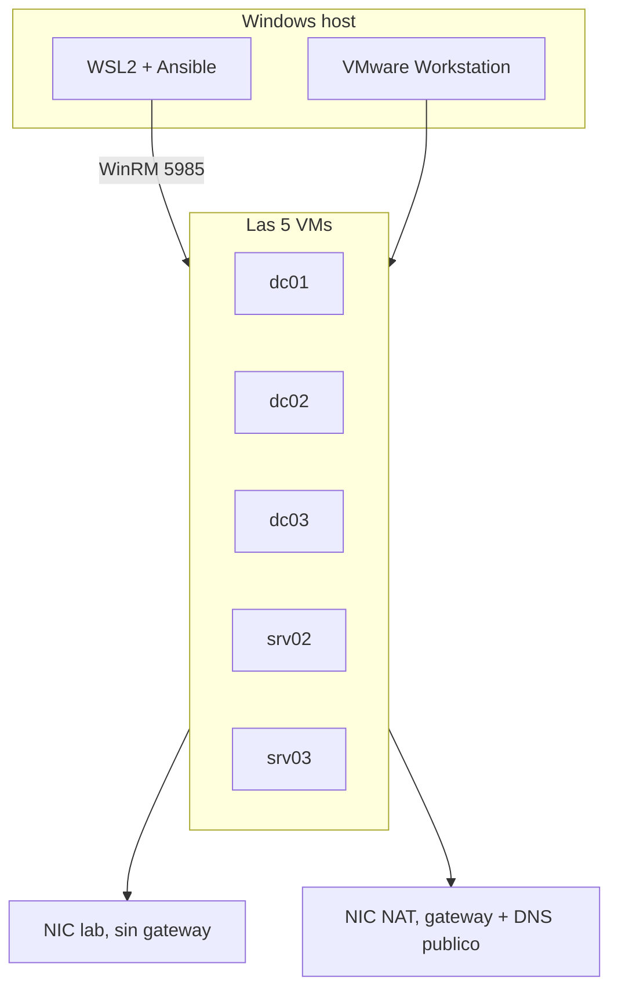
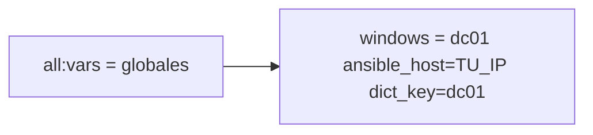

# GOAD desde WSL contra VMware

Monte GOAD (el de Orange-Cyberdefense) sin pasar por Vagrant. Las cinco Windows estan en VMware Workstation y Ansible corre desde WSL2. Este repo es lo que me hubiera gustado leer el dia 1, no un reemplazo del README oficial.

## Por que no use el provider de VMware

GOAD espera esto:

- en el Windows host: Vagrant + plugin `vagrant-vmware-desktop` + VMware Utility
- `vagrant up` en `ad/GOAD/providers/vmware`
- Ansible en Linux (`goad.sh` o una VM controller)

El plugin en Windows me salio mal (provider que no aparece, pelea de gems al instalar plugins, utility/certs). Hay issues viejos en el repo de GOAD por lo mismo: [#346](https://github.com/Orange-Cyberdefense/GOAD/issues/346), [#392](https://github.com/Orange-Cyberdefense/GOAD/issues/392).

WSL no habla con VMware por ese plugin. Si `vagrant up` no te levanta las cajas, te queda armar las VMs a mano, abrir WinRM y tirar Ansible desde WSL. Eso hice.

WSL tambien me jodio un rato:

- clone en `/mnt/c/...` y Ansible ni mira el `ansible.cfg` (directorio world writable)
- la IP de WSL2 no es la del host-only, el trafico se va por otro lado
- timeout WinRM de 30s en medio de un dcpromo
- ansible-core nuevo (2.19+) que ya no traga `when: two_adapters` cuando `two_adapters` vale `"yes"`

Si a ti el plugin te funciona, no sigas esto. Usa el inventory oficial y `goad.sh`.

## Las IPs no estan fijas

En los ejemplos pongo `192.168.56.x` porque es lo tipico de VMnet host-only. La tuya puede ser `192.168.100.0/24` o lo que hayas dejado en Virtual Network Editor.

Lo unico que tiene que coincidir es `ansible_host` con la NIC del lab de cada VM. `dict_key` se queda en `dc01` / `dc02` / etc. como en `config.json`.



Dos NICs por maquina. En serio. La del lab sin gateway. La NAT con `1.1.1.1` / `8.8.8.8`. Si no, NuGet no existe y SQL tampoco baja.

## Mapa (ejemplo)

Passwords = `local_admin_password` de `ad/GOAD/data/config.json`. Si las cambiaste en tu clone, usa esas.

| host | nombre que pone GOAD | IP de ejemplo | dominio |
|---|---|---|---|
| dc01 | kingslanding | 192.168.56.10 | sevenkingdoms.local |
| dc02 | winterfell | 192.168.56.11 | north.sevenkingdoms.local |
| dc03 | meereen | 192.168.56.12 | essos.local |
| srv02 | castelblack | 192.168.56.22 | north.sevenkingdoms.local |
| srv03 | braavos | 192.168.56.23 | essos.local |

Claves del json canonico, por si no lo tienes a mano:

- dc01 `8dCT-DJjgScp`
- dc02 y srv02 `NgtI75cKV+Pu`
- dc03 `Ufe-bVXSx9rk`
- srv03 `978i2pF43UJ-`

`Password1` solo vale **antes** de `settings/admin_password`. Despues de esa tarea el SAM ya no es esa clave y el hostname task te tira 401 en las cinco.

## Capturas

Si subes fotos al repo o a un writeup, tapa IPs, el usuario de tu Windows, rutas `/home/...` y cualquier `-e ansible_password=`. Un `PLAY RECAP` alcanza. Un `ipconfig` entero no.

## Inventory

Plantilla en [docs/INVENTORY.md](docs/INVENTORY.md).

`[all:vars]` es solo variables. Las lineas de host van en `[windows]`. Si las metes en `all:vars`, Ansible se inventa una variable llamada `dc01 ansible_host` y luego dice que NTLM no tiene password.



Otras cosas que me costaron:

- falta `dict_key` y `lab.hosts[dict_key]` no resuelve
- el grupo se llama `[server]`, no `[servers]`
- timeouts `400` / `500` (`read` tiene que ser mayor que `operation`)
- `[adcs]` oficial: dc01 y srv03. `[adcs_customtemplates]`: dc03. Sin eso no hay CertSvc y ESC6 peta con `FILE_NOT_FOUND`
- `[laps_dc]` oficial es dc03. Si metes los tres DC, LAPS en el hijo sale con referral/FSMO

## ansible.cfg

```ini
[defaults]
allow_broken_conditionals = true
```

o `export ANSIBLE_ALLOW_BROKEN_CONDITIONALS=true` si te ignora el cfg.

Y clona GOAD en `~/GOAD`, no en `/mnt/c`.

## Orden

```bash
cd ~/GOAD/ansible
ansible-playbook -i inventory.ini build.yml
ansible-playbook -i inventory.ini ad-servers.yml
ansible-playbook -i inventory.ini ad-parent_domain.yml
ansible-playbook -i inventory.ini ad-child_domain.yml
ansible-playbook -i inventory.ini ad-members.yml
ansible-playbook -i inventory.ini ad-trusts.yml
ansible-playbook -i inventory.ini ad-data.yml
ansible-playbook -i inventory.ini ad-gmsa.yml
# laps.yml me fallo. lo deje. el lab sigue
ansible-playbook -i inventory.ini localusers.yml
ansible-playbook -i inventory.ini ad-relations.yml
ansible-playbook -i inventory.ini adcs.yml
ansible-playbook -i inventory.ini ad-acl.yml
ansible-playbook -i inventory.ini servers.yml
ansible-playbook -i inventory.ini security.yml
ansible-playbook -i inventory.ini vulnerabilities.yml
ansible-playbook -i inventory.ini reboot.yml
```

`main.yml` se puede relanzar. Si se cae una tarea, arregla esa y vuelve a tirar el mismo playbook.

## Lo que me rompio, en orden

La tabla corta esta en [docs/ERRORES.md](docs/ERRORES.md).

**Internet en las VMs.** `Install-PackageProvider NuGet` no es un bug de Ansible. Es que la caja no sale por 443. NAT + DNS en la NIC que tiene gateway.

**401 en Change the hostname.** El rol de password ya escribio la clave del json. El inventory seguia con `Password1`.

**dc02 despues del child domain.** WinRM en localhost respondia y desde WSL no. NTLM contra la IP se queda buscando Kerberos. En winterfell:

```powershell
winrm set winrm/config/service '@{AllowUnencrypted="true"}'
winrm set winrm/config/service/auth '@{Basic="true"}'
```

y en la linea de dc02: `ansible_winrm_transport=basic`.

**LAPS.** `Invalid type PSObject` / `mayContain`. Es el modulo `win_ad_object` ([issue 449](https://github.com/Orange-Cyberdefense/GOAD/issues/449)). Relanzar no lo arregla. Segui con `localusers.yml`.

**ESC13.** Queria copiar a `C:\setup` y la carpeta no existia. `New-Item C:\setup -ItemType Directory`.

**SQL.** El SSEI que pinnea GOAD en 2026 Microsoft lo retiro (*installer is no longer supported*). En `/QUIET` parece un hang: proceso a 0% y `media\` vacio. Baje el media offline `SQLEXPR_x64_ENU.exe` (~250 MB), extrae, y `setup.exe` con flags. El `sql_conf.ini` del rol me llego con basura Jinja (`//{%`) y setup se quejo de la sintaxis.

SSMS por `aka.ms/ssmsfullsetup` me bajo 5 MB. Lo deje. Vacia `[mssql_ssms]`.

**`no hosts matched` en linux_domain.** No hay Linux. Normal.

## Comprobar

```bash
ansible-inventory -i inventory.ini --host dc01
ansible dc01,dc02,dc03,srv02,srv03 -i inventory.ini -m ansible.windows.win_ping
```

En el DC la imagen esta en ingles: `systeminfo | findstr /I "Domain Workgroup"`. La linea es `Domain:`, no Dominio.

`curl` a `:5985` que responde `411` = el HTTP de WinRM esta vivo.

## Lo que no termine y no me importo

LAPS redondo, SSMS, y cualquier play de Linux. El bosque, trusts, ADCS y SQL en castelblack si quedaron.

Lab original: [Orange-Cyberdefense/GOAD](https://github.com/Orange-Cyberdefense/GOAD). Esto es de septiembre 2026; las URLs de Microsoft se mueren solas.
